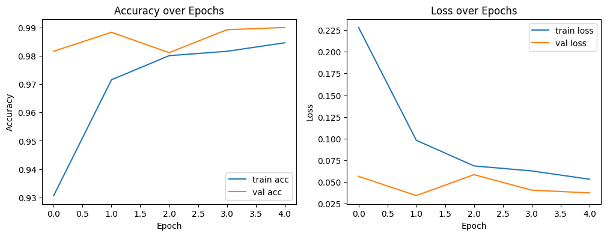
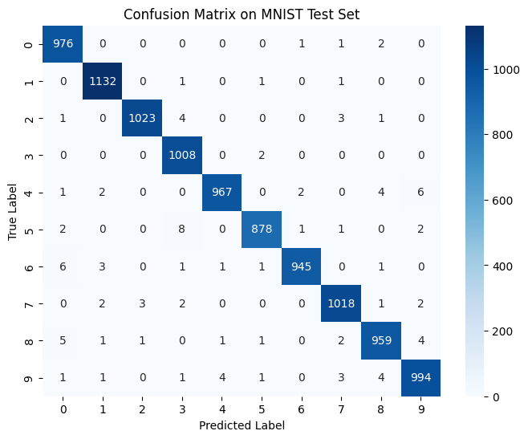

# MNIST Digit Classifier (CNN) — Flask Deployment
Convolutional Neural Network trained on MNIST (98.5% accuracy). Deployed on a serverless Flask API.
---
## Upload a handwritten digit and see predictions:

---

## Flask API
- `digit_classifier_app.py` 
- Accepts an image (PNG/JPG)
- Returns the predicted digit + top-3 probabilities in JSON:
  {
    "prediction": 7,
    "confidence": 0.993,
    "top3": [{"digit":7,"prob":0.993}, ...]
  }

# Model
- CNN in TensorFlow/Keras
- Training notebook: `MNIST_Digit_classifier_Notebook.ipynb`
- Architecture: Conv2D + Norm → Pool → Conv2D → Norm → Pool → Flatten → Dense → Dense
- Trained on MNIST; test accuracy: 98.5%
- Model file: [mnist_cnn.h5](https://github.com/blipovet/mnist-digit-classifier/releases/tag/v1.0)

---

## Quick start
1. Clone:
```bash
git clone https://github.com/<your-username>/mnist-digit-classifier.git
cd mnist-digit-classifier
```

2. Create a virtual environment and install:
```
python -m venv venv
source venv/bin/activate   # mac/linux
# or: venv\Scripts\activate  on Windows PowerShell
pip install -r requirements.txt
```

3. Run the Flask app:
```
python digit_classifier_app.py
```

5. Test with curl:
```
curl -X POST http://127.0.0.1:5000/predict -F "file=@sample_digit.png"
```

---


## Model Analysis:
### Accuracy and Loss
  <p align="center">
  
  </p>
  
### Confusion matrix: 
  <p align="center">
  
  </p>
  
  The model predicted a **1** most accurately.
  Its most frequent errors are confusing **6 → 0** and **4 → 9**.
  
## License
MIT License © 2025 Boris L. Palermo
