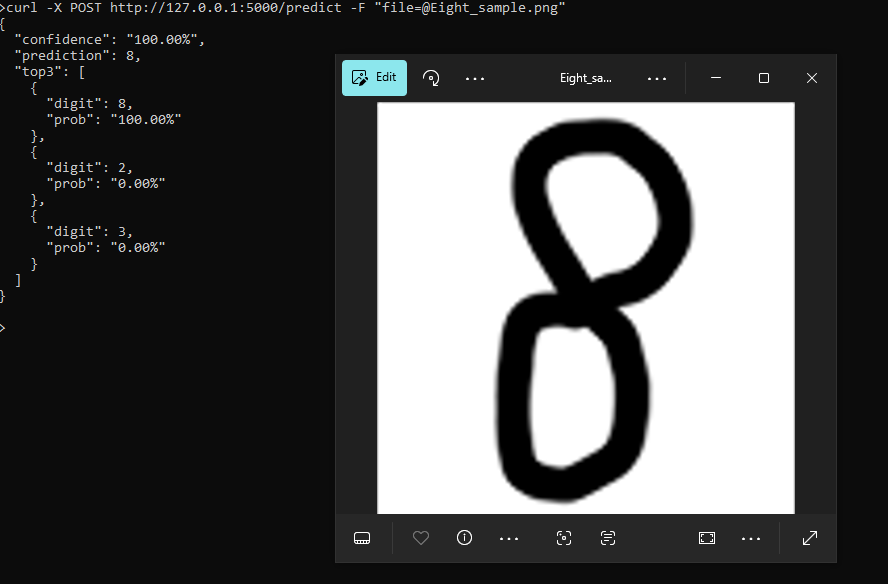

# MNIST Digit Classifier (CNN) — Flask Deployment

Convolutional Neural Network trained on MNIST (≈98% test accuracy). Deployed on a serverless Flask API. Includes example notebook and demo.
---
## Upload a handwritten digit and see predictions:

---

## Features
- CNN in TensorFlow/Keras
- Training notebook: `MNIST_Digit_classifier_Notebook.ipynb`
- Flask API: `digit_classifier_app.py` — accepts an image and returns predicted digit + top-3 probabilities

---

## Quick start
1. Clone:
```bash
git clone https://github.com/<your-username>/mnist-digit-classifier.git
cd mnist-digit-classifier
```

2. Create a virtual environment and install:
```
python -m venv venv
source venv/bin/activate   # mac/linux
# or: venv\Scripts\activate  on Windows PowerShell
pip install -r requirements.txt
```

3. Run the Flask app:
```
python digit_classifier_app.py
```

5. Test with curl:
```
curl -X POST http://127.0.0.1:5000/predict -F "file=@sample_digit.png"
```

---

## API
POST /predict
- Accepts PNG/JPG or raw image bytes
- Returns JSON:
  {
    "prediction": 7,
    "confidence": 0.993,
    "top3": [{"digit":7,"prob":0.993}, ...]
  }

## Model
- Architecture: Conv2D + Norm → Pool → Conv2D → Norm → Pool → Flatten → Dense → Dense
- Trained on MNIST; test accuracy: 98.5%
- Model file: [mnist_cnn.h5](https://github.com/blipovet/mnist-digit-classifier/releases/tag/v1.0/mnist_cnn.h5)

